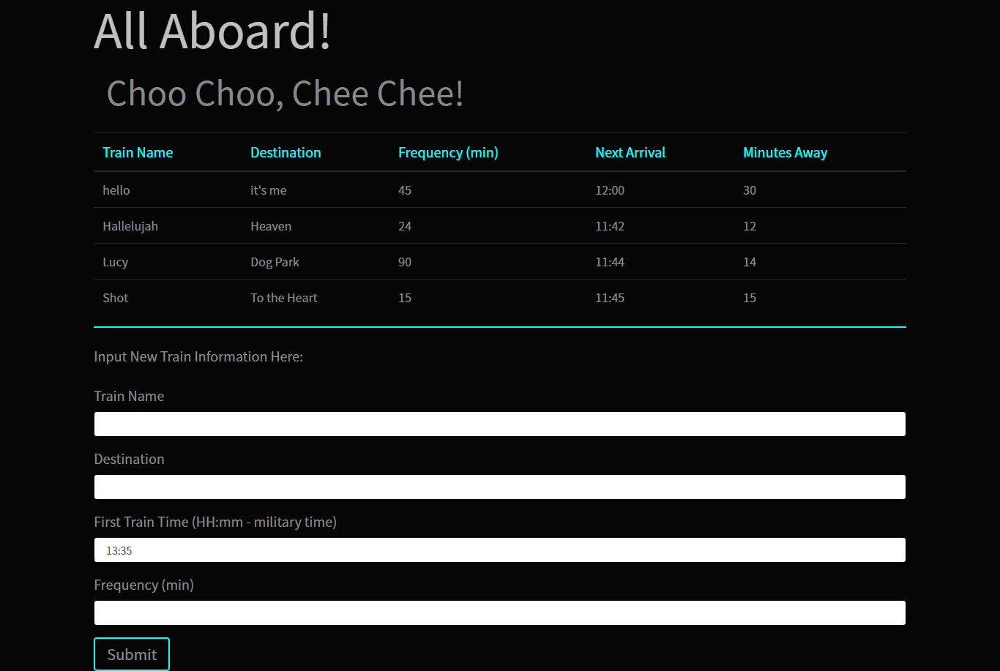

# Train-Scheduler
This app demonstrates the ability to take user data and store it in the Google Firebase database. The data is then manipulated using javascript to create a train schedule that shows the time of the next train and the number of minutes away it is.


## Functionality 💪
#### Here's how the app works: 


* The train schedule information is displayed at the top of the page, with the user-submitted form at the bottom of the page. The form takes the train name, destination, start time, and frequency.  Upon submit, the user data is taken and stored in Firebase.
```
$("#submit").on("click", function(event){
    event.preventDefault();
    var trainName = $("#trainName").val().trim();
    var destination = $("#destination").val().trim();
    var startTime = $("#startTime").val().trim();
    var frequency = $("#frequency").val().trim();

    var newTrain = {
        name: trainName,
        dest: destination,
        start: startTime,
        freq: frequency,
    }

    database.ref().push(newTrain);

    // console.log(newTrain.name);    
    // console.log(newTrain.dest);
    // console.log(newTrain.start);
    // console.log(newTrain.freq);

    alert("Train successfully added!");

    $("#trainName").val("");
    $("#destination").val("");
    $("#startTime").val("");
    $("#frequency").val("");

})
```

* Each snapshot of data is then referenced to do the math to get the next train time and minutes away, using Moment JS to manipulate the start time of the train.

```
var startTimeConverted = moment(startTime, "hh:mm").subtract(1, "years");

var currentTime = moment();

//difference between current time and startTime in minutes
var timeDifference = currentTime.diff(moment(startTimeConverted), "minutes");

//get the remainder b/t the difference in time and the frequency
var remainder = timeDifference % frequency;

//minutes away will be the difference b/t the frequency and the remainder.
var minutesAway = frequency - remainder;

var nextArrival = currentTime.add(minutesAway, "minutes").format("hh:mm");

```

* The new information (next arrival and minutes away), along with the train name, destination and frequency are then displayed on the page.


## Getting Started 🏁

These instructions will get you a copy of the project up and running on your local machine for grading and testing purposes. 

1. clone repository. 
2. open repository in your IDE of choice.
3. view `logic.js` for logic.
4. view `index.html` for the document.
5. view `style.css` for the style.
6. open `index.html` in browser of choice to demo the application locally.


## Built With 🔧

* [Firebase](https://firebase.google.com) - database used.
* [Bootstrap](https://getbootstrap.com/) - css framework used.
* [JQuery](https://cdnjs.cloudflare.com/ajax/libs/jquery/3.2.1/jquery.min.js) - JavaScript library used.
 

## Authors ⌨️

* **Genevieve DePriest** - [gdepriest](https://github.com/gdepriest)

## Acknowledgments 🌟

* Amber Burroughs, Tutoring badass
* Lindsey, TA goddess
* Grace, TA goddess
* Sarah Cullen, Maestro
